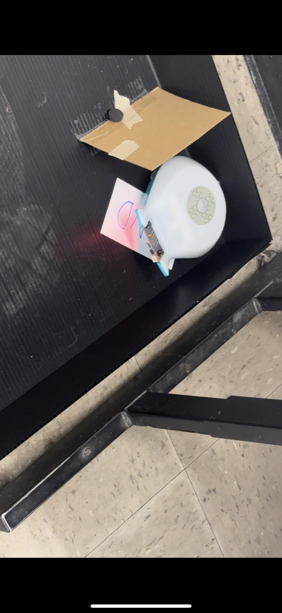

# Final Project: Finch Robot Challenges

## Essential Question
How can we apply object-oriented programming principles and Java concepts to create interactive, autonomous robot behaviors that solve real-world challenges?

## Project Overview
In this project-based learning experience, you will program a Finch 2.0 robot to perform one of three challenges:
1. Choreograph a dance routine (with movement, lights, and sound)
2. Create an artistic drawing using the robot's movements
3. Navigate a maze autonomously

Your program must demonstrate your understanding of Java programming concepts from APCSA and object-oriented design principles while creating an engaging robot behavior.

## Learning Objectives
- Apply Java programming concepts in a physical computing context
- Implement object-oriented design principles
- Develop problem-solving skills through algorithm development
- Create well-documented and maintainable code
- Practice technical communication through presentations and documentation

## Description of design choices
We built and used our program to follow through with the maze from Start to Finish. We were able to use the move forward, right, left, and used the beep noise in order to indicate itself. 
## Challenges faced and solutions
A challenge we faced was taking too much time on deciding what we should do. Originally, we wanted to do the final based on a dancing finch, however, we changed our decision and decided for our finch to go through the maze which took a bit of time but we were able to go through together. 
## Future enhancements
Some future enhancements would be to actually improve our beeping design and make a maybe forloop to show how we can make this finch more simple and easier to go through the maze. We would also want our finch to be colorful when going through the maze so if we had time we could apply colors and music too!
## Video or images of your robot in action (embedded or linked)
 
